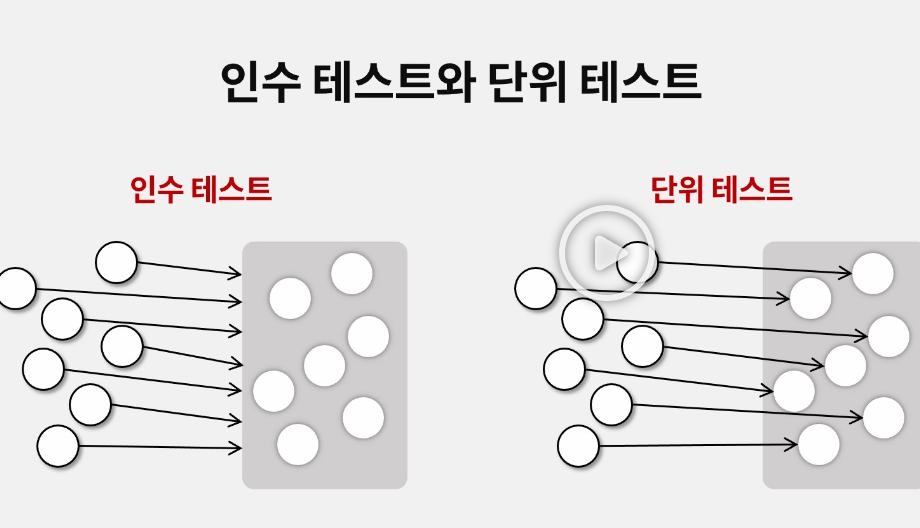

## 수동테스트
- 품질 담당자가 UI를 통해 직접 기능을 검증
- 실행 비용이 높고 결과의 변동이 큼

## 소프트웨어 회귀
- 원래 동작하던 것들이 특정 작업에 의해 동작하지 않는 것

## 수동테스트의 단점
- 소프트웨어 회귀에 의해 변경 사항이 있을 때마다 전체 테스트를 진행해야함
- 시간적으로 상당히 손해를 봄

## 테스트 자동화
- 기능을 검중하는 코드를 작성
- 테스트 코드 작성 비용이 소비되지만 실행 비용이 낮고 결과의 신뢰도가 높음
- 테스트 코드 작성과 관리가 프로그래머 역량에 크게 받음

## 인수테스트
- 배치된 시스템을 대상으로 검증
- 전체 시스템 이상 여부 신뢰도가 높음
- 높은 비용
- 피드백 품질이 낮음

## 인수테스트 vs 통합테스트 차이
| 항목 | 자동 인수 테스트 (Acceptance Test)                | 통합 테스트 (Integration Test)                      |
| ----------- | ------------------------------------------ | ---------------------------------------------- |
| **목적**      | **요구사항을 만족하는지 검증**<br>(= 사용자의 관점)          | **모듈 간 통합이 잘 작동하는지 검증**<br>(= 시스템 내부 관점)       |
| **주요 관심사**  | 기능이 사용자 시나리오대로 작동하는가? | 여러 컴포넌트가 함께 잘 동작하는가? |
| **작성 대상**   | 로그인 시나리오, 결제 흐름, 게시글 작성 등 | DB 연결, 서비스-레포지토리 간 연결 등 |
| **대상 계층**   | API or UI 단 → 전체 시스템 흐름 테스트 | 일반적으로 서비스 or API 단 |
| **테스트 스타일** | 종단 간(E2E) 또는 API 기반 시나리오 테스트 | 일부 시스템 통합 (ex. DB 연동 포함)                       |
| **도구 예시**   | RestAssured, Cucumber, Cypress, Playwright | SpringBootTest, @Transactional, Testcontainers |

**자동 인수 테스트**
```java
mockMvc.perform(post("/api/signup")
    .contentType(MediaType.APPLICATION_JSON)
    .content("{ \"email\": \"test@example.com\", \"password\": \"1234\" }"))
  .andExpect(status().isOk())
  .andExpect(jsonPath("$.message").value("회원가입 성공"));

```
**통합 테스트**
```java
@SpringBootTest
@Transactional
class MemberServiceIntegrationTest {

  @Autowired
  MemberService memberService;

  @Test
  void 회원가입_성공() {
    Member member = new Member("test@example.com", "1234");
    memberService.register(member);
    assertNotNull(memberRepository.findByEmail("test@example.com"));
  }
}
```


## 단위테스트
- 시스템의 일부를 대상으로 검증
- 낮은 비용
- 높은 피드백 품질
- 전체 시스템 이상 여부 신뢰도가 낮음

